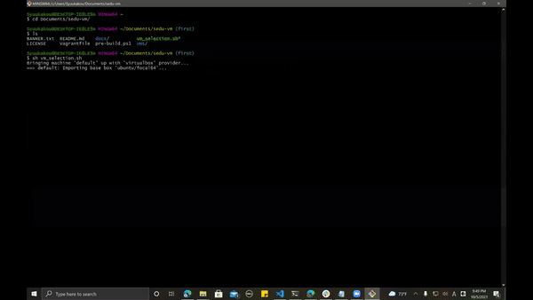
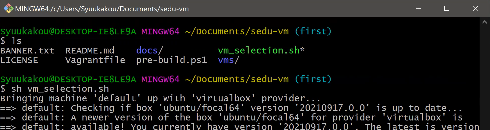
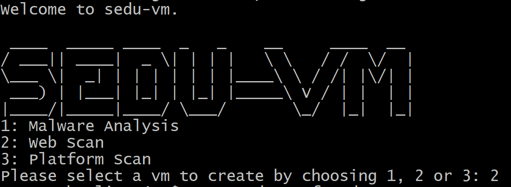
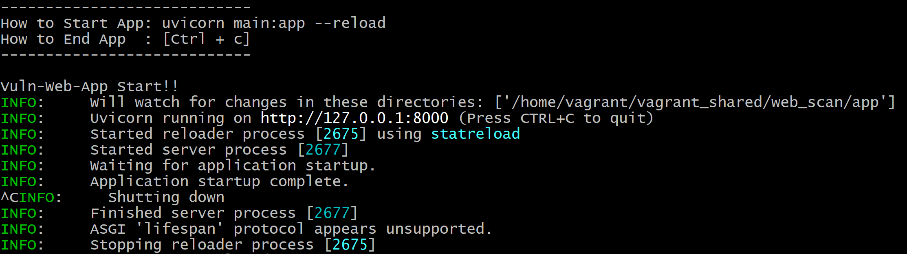
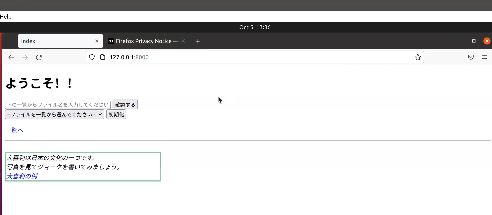

# sedu-vm

sedu-vm: <span style="color: red;">se</span>curity + <span style="color: red;">edu</span>cation + vm

```
 ____  _____ ____  _   _    __     ____  __ 
/ ___|| ____|  _ \| | | |   \ \   / /  \/  |
\___ \|  _| | | | | | | |____\ \ / /| |\/| |
 ___) | |___| |_| | |_| |_____\ V / | |  | |
|____/|_____|____/ \___/       \_/  |_|  |_|
                                            
```

- [日本語版 README](https://github.com/tdu-isl/sedu-vm/blob/main/docs/README_JP.md)

## Description

This is the automatic building scripts of multiple cyber security-related tool and environments.

## Demo

<div align="center">

</div>

## ScreenShots
<div align="center">
<p> Start Installation

<p> Select Web Scan

<p> Web Scan Installed

<p> Check the Web Scan Status

</div>

## Tool/Environment

- [Malware Analysis](https://github.com/tdu-isl/sedu-vm/tree/main/vms/malware_analysis)
- [Web Scan](https://github.com/tdu-isl/sedu-vm/tree/main/vms/web_scan)
- [Platform Scan](https://github.com/tdu-isl/sedu-vm/tree/main/vms/platform_scan)

## Install

1. Clone this repository to your computer
2. Open Powreshell as Administrator, 
3. Use ```cd``` command to get into the repository folder. Type ```Set-ExecutionPolicy RemoteSigned -scope CurrentUser -Force```, and run ```.\pre-build.ps1``` command to install chocolatey, vagrant and virtualbox.
4. Restart Powershell, and run below commmands to install vagrant plugins
   ```
   vagrant plugin install vagrant-disksize
   vagrant plugin install vagrant-vbguest
   ```
5. Open Git bash, and use ```cd``` command to get into the repository folder
6. Run ```sh vm_selection.sh``` command to start installation
7. After the Ubuntu 20.04 virtual machine installed, you will be asked to select which tool or environment to install. Please select one of them. The installation will take some time :coffee:

## Note
1. Make sure that the 'Hyper-V' and 'Virtual Machine Platform' are disabled in Windows Features. When the "Virtual Machine Platform" disabled, the Windows Subsystem Linux (WSL) cannot be used anymore (The error info is shown below). Type ```bash``` command in CMD after 'Virtual Machine Platform' is disabled, you will get below error. Therefor, please use **Git Bash** to run the ```sh vm_selection.sh```.
<br>```Please enable the Virtual Machine Platform Windows feature and ensure virtualization is enabled in the BIOS.For information please visit https://aka.ms/wsl2-install```

1. The installed Ubuntu 20.04's configurations on your computer are:
   > The configuration of the Ubuntu can be modified in the ```Vagrantfile: vb.customize```
   1. Virual machine name: ```sedu_vm```
   2. Login name / Password: ```vagrant``` / ```vagrant```
   3. GUI: ```True```
   4. CPU: ```4```
   5. Memory: ```4096M```
   6. Video RAM: ```256M```
   7. Disk size: ```50GB```
   8. Copy and Paste between host and guest: ```bidirectional```


## Doing
- Extension of platform diagnostic environment

## ToDo
- Adding environments

  1. Making the Cuckoo Sandbox a Docker container
  2. Platform diagnostic environment
     - Currently, metasploitable2 is prepared as the attack server, but we want to include the process of "fixing the server" in the exercise, so we are thinking of preparing the actual vulnerable target by Docker.
  3. Blockchain diagnostic environment
     - Prepare an application that uses smart contracts so that you can practice diagnostics with a blockchain diagnostic tool. (We have not found a free diagnostic tool yet.)
  4. Container diagnostic environment
     - Similar to Web diagnostics, by creating a vulnerable container image according to the container security policy and using a free container scan tool, you can learn how to use the container scan tool and learn the security that you should be aware of in the container. do.
  5. Pure Linux or WSL environment
     - Since Linux is often used for security education, it can be used for exercises to secure the server just by preparing pure Linux, and WSL, which is a function unique to Winodws, can also prepare an environment with one desk. I think it's convenient.

- UI improvement

   1. Improve the first tool / environment selection screen to make it easier to use and multiple-choice

## Licence

[MIT](https://github.com/tdu-isl/sedu-vm/blob/main/LICENSE)

## Author

- [:boy:Fumiya Kurihara](https://github.com/kur1h4r4)
- [:boy:Ryosuke Okayasu](https://github.com/RyosukeOkayasu)
- [:boy:Ziyuan Yang](https://github.com/Twinsoul-Y)
- [:boy:Teruki Yoshikawa](https://github.com/terib0l)
- [:boy:Yuki Yoshida](https://github.com/y0sh1da)
- [:man:Jiaxing Zhou](https://github.com/Syuukakou)
